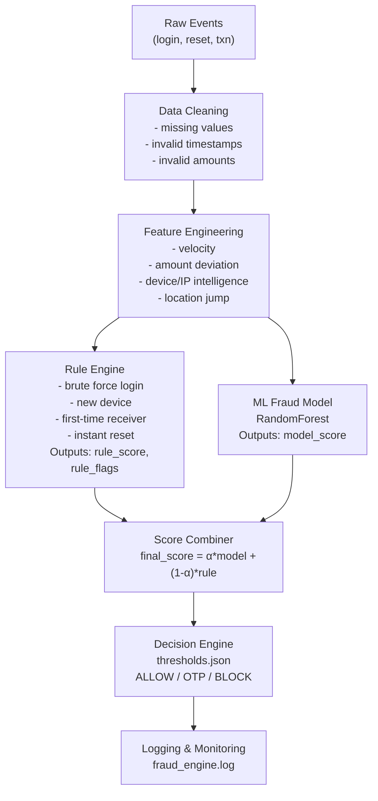

# 🛡️ **Fraud Risk Intelligence System**

*A Production-Style Fraud Detection Pipeline with Rules + Machine Learning + Real-Time API*

---

## 🔍 **1. Overview**

This project implements a **Fraud Risk Intelligence System** inspired by real-world financial fraud engines used in modern fintech companies.
It combines:

* **Behavioral rule engine**
* **Machine learning fraud model**
* **Risk score blending**
* **Threshold-based decisioning**
* **Event-level feature engineering**
* **Temporal validation**
* **Synthetic dataset generation**
* **Logging & monitoring components**
* **FastAPI real-time scoring service** 
* **Model loader + inference pipeline** 

The system ingests raw activity events (logins, password resets, transactions) or direct model features and produces a final decision:

```
ALLOW / OTP_CHALLENGE / BLOCK
```

This project is fully modular, production-oriented, and suitable for both offline ML workflows and real-time fraud scoring.

---

## 🏗️ **2. System Architecture**

### **Offline Fraud Pipeline Architecture**



---

### 🌐 **Real-Time Fraud Scoring Architecture (FastAPI Layer)**

In addition to the offline pipeline, the project includes a **live scoring API** that uses the same decision engine.

```mermaid
flowchart TD
    A[Client Request] --> B[Pydantic Validation]
    B --> C[Feature Preprocessing]
    C --> D[ML Model Scoring]
    C --> E[Rule Engine Evaluation]
    D --> F[Decision Pipeline]
    E --> F
    F --> G[Final Decision\n(ALLOW / OTP / BLOCK)]
```

---

## 🧪 **3. Dataset (Synthetic)**

Since real financial fraud data is confidential and regulated, this project uses a **synthetic dataset** that simulates:

* 61,043 events
* 500–2000 users
* realistic transaction patterns
* login failures
* device & IP changes
* high-amount anomalies
* location changes
* engineered fraud labels

Generated using:

```
data/synthetic/generate_synthetic_data.py
```

Output file:

```
data/synthetic/transactions.csv
```

---

## ⚙️ **4. End-to-End Pipeline**

The offline training pipeline consists of:

1. Load synthetic raw data
2. Clean invalid rows
3. Feature engineering
4. Temporal train/test split
5. Imbalance handling
6. Train ML model (Random Forest)
7. Evaluate with metrics
8. Generate thresholds
9. Save model + metadata

Run with:

```
python pipeline/run_training_pipeline.py
```

---

## 🧠 **5. Feature Engineering**

Behavioral and statistical features include:

### **Login & Device Features**

* failed_login_10min
* new_device_flag
* new_ip_flag

### **Transaction Features**

* z_amount
* tx_count_5min
* first_time_receiver_flag

### **Location Features**

* distance_from_last_location_km

### **Security Features**

* time_between_login_reset_sec

These replicate signals used by real fraud-surveillance systems.

---

## 🧩 **6. Rule Engine**

A lightweight but high-impact rule engine assigns:

```
rule_score (0–1)
rule_flags (list of triggered rules)
```

Rules include:

* Too many failed logins
* New device used
* First-time receiver
* Instant password reset
* High-risk location jump
* Unusual transaction amount

**Offline rule engine file:**

```
scoring/rule_engine.py
```

**Real-time rule engine file:**

```
utils/rules.py
```

---

## 🤖 **7. Machine Learning Model**

A RandomForest classifier is used for offline training.

Real-time scoring uses a simplified model saved at:

```
models/model.joblib
```

Loaded via:

```
utils/model_loader.py
```

Evaluation includes:

* AUC
* Recall @ low FPR
* Precision@K
* Fraud capture rate
* Detection latency

---

## 📊 **8. Threshold Logic**

Thresholds:

```
low = 0.30
medium = 0.55
high = 0.80
```

Decision mapping:

* `score >= high` → **BLOCK**
* `score >= medium` → **OTP Challenge**
* `score < medium` → **ALLOW**

Forced rule flags override thresholds.

---

## 🧮 **9. Decision Pipeline**

The decision engine merges:

* ML model score
* Rule score
* Rule flags
* Thresholds
* Forced rule overrides

Returns:

```
{
  "action": "BLOCK",
  "final_score": 0.82,
  "reasons": ["score>=high", "rule:new_device"],
  "context": {"user_id": 101, "amount": 7000}
}
```

Offline decision pipeline:

```
scoring/decision_pipeline.py
```

Real-time decision pipeline:

```
pipeline/decision_pipeline.py
```

---

## 📈 **10. Monitoring & Logging**

Tracks:

* Rule triggers
* Model outputs
* Threshold decisions
* Errors
* Training events

Log output stored in:

```
logs/fraud_engine.log
```

---

## 📉 **11. Visual Results**

Generated via:

```
python pipeline/make_plots.py
```

Stored in:

```
data/plots/
```

Includes:

* Fraud Rate Over Time
* Transaction Distribution
* Device Patterns
* Login Velocity

---

## ▶️ **12. How to Run the System**

### **Install Dependencies**

```
pip install -r requirements.txt
```

---

### **Generate Synthetic Dataset**

```
python data/synthetic/generate_synthetic_data.py
```

---

### **Train Offline Pipeline**

```
python pipeline/run_training_pipeline.py
```

---

### **Run Full Offline System Test**

```
python tests/run_full_system_test.py
```

---

### 🌐 **Run Real-Time API Service (FastAPI)**

```
python -m uvicorn api.main:app --reload
```

Open Swagger UI:

```
http://127.0.0.1:8000/docs
```

Example request:

```
POST /api/v1/predict
{
  "features": [0.9, 0.9, 0.9]
}
```

---

## 📁 **13. Project Structure**

```md
├── api
│   ├── main.py
│   ├── routers/
│   │   └── predict.py
│   └── schemas/
│       └── predict.py
│
├── pipeline
│   ├── clean.py
│   ├── features.py
│   ├── split.py
│   ├── imbalance.py
│   ├── train_model.py
│   ├── evaluate.py
│   ├── make_plots.py
│   ├── run_training_pipeline.py
│   ├── model_pipeline.py
│   └── decision_pipeline.py
│
├── utils
│   ├── loader.py
│   ├── validators.py
│   ├── logger.py
│   ├── model_loader.py
│   ├── preprocess.py
│   ├── postprocess.py
│   └── rules.py
│
├── models/
│   └── model.joblib
│
├── data/
│   ├── synthetic/
│   │   ├── transactions.csv
│   │   └── generate_synthetic_data.py
│   └── plots/
│       ├── amount_distribution.png
│       ├── fraud_rate_over_time.png
│       └── ...
│
├── tests/
│   └── run_full_system_test.py
│
├── generate_model.py
├── requirements.txt
└── README.md
```

---

## 🚀 **14. Future Improvements**

* Advanced rule engine
* Device fingerprinting
* Geolocation intelligence
* Gradient boosting models (XGBoost/LightGBM)
* Adaptive thresholds
* Fraud drift detection
* SHAP interpretability
* Kafka or streaming pipeline
* CI/CD + Docker

---

## 👤 **15. Author**

Fraud Risk Intelligence System
Built by **@minturam21**
For ML Engineer / Data Scientist roles.
